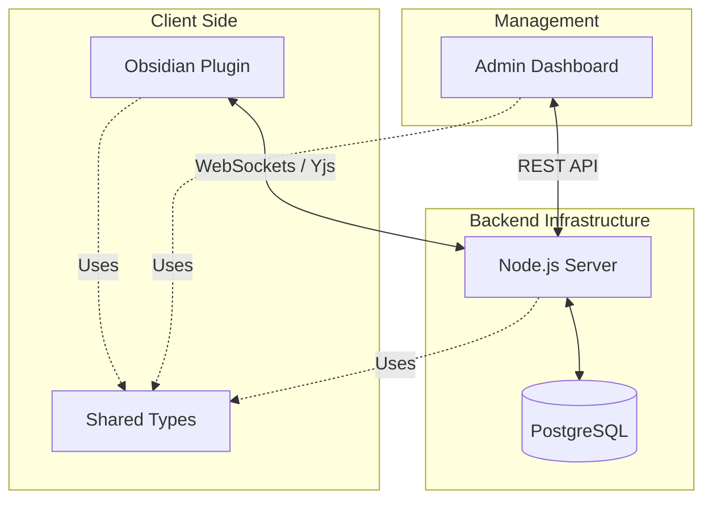

# Obsidian Collaborative Plugin Monorepo

This monorepo contains the source code for the Obsidian Collaborative Plugin ecosystem, including the Obsidian plugin itself, the backend server, and the admin dashboard.



## What it does
The Obsidian Collaborative Plugin transforms Obsidian into a multi-user collaborative environment. It enables real-time synchronization of notes across different users and devices while maintaining privacy through end-to-end encryption. The ecosystem includes a high-performance backend server for data orchestration and an administrative interface for system management.

## Key Features
- **🔒 End-to-End Encryption**: Secure your notes with client-side encryption. Only you and your collaborators hold the keys.
- **⚡ Real-time Sync**: Experience seamless multi-user editing powered by Yjs and WebSockets.
- **🛠️ Self-Hosted Freedom**: Full control over your data with an easily deployable Node.js backend and PostgreSQL database.
- **🖥️ Admin Control**: Dedicated dashboard to manage users, monitor system health, and oversee the ecosystem.
- **📦 Monorepo Architecture**: Clean, type-safe development using shared logic across the plugin, server, and dashboard.

## Project Structure

- **packages/plugin**: The Obsidian plugin (client-side).
- **packages/server**: The Node.js/Express backend server with WebSocket support.
- **packages/admin**: The Next.js Admin Dashboard.
- **packages/shared**: Shared TypeScript types and utilities.

## Prerequisites

- **Node.js**: v18 or higher.
- **npm**: v9 or higher (supports workspaces).
- **PostgreSQL**: v14 or higher.

## Setup Instructions

1.  **Clone the repository:**
    ```bash
    git clone <repository-url>
    cd obsidian-collaborative-plugin
    ```

2.  **Install dependencies:**
    ```bash
    npm install
    ```

3.  **Database Setup:**
    - **Step 3a:** Check if PostgreSQL is running and access the prompt (Windows):
        ```bash
        psql -U postgres
        ```
        *(If asked for a password, enter the one you set during installation)*

    - **Step 3b:** Create the database:
        ```sql
        CREATE DATABASE obsidian_collab;
        \q
        ```

    - **Step 3c:** Configure environment:
        - Copy `.env.example` to `packages/server/.env` (if not done).
        - Update `DB_PASSWORD` in `packages/server/.env` with your Postgres password.

    - **Step 3d:** Initialize the schema:
        ```bash
        npm run init-db --workspace=@obsidian-collaborative/server
        ```

4.  **Admin Migration (Optional):**
    - To add admin roles to the database:
        ```bash
        npx ts-node packages/server/scripts/migrate-admin.ts
        ```

## Development Workflow

### Running the Server
```bash
npm run dev --workspace=@obsidian-collaborative/server
```
The server runs on `http://localhost:3008`.

### Building the Plugin
```bash
npm run dev --workspace=obsidian-collaborative-plugin
```
This watches source changes and rebuilds `packages/plugin/main.js`. Point your Obsidian plugin folder to `packages/plugin` or copy `main.js` and `manifest.json` into your vault plugin directory.

### Workspace Validation
```bash
npm run build
npm run test
```
`npm run build` runs every workspace build script. `npm run test` currently runs the server backup-policy test suite and skips packages without tests.

### Running the Admin Dashboard
```bash
npm run dev --workspace=@obsidian-collaborative/admin
```
The dashboard runs on `http://localhost:3000`.
